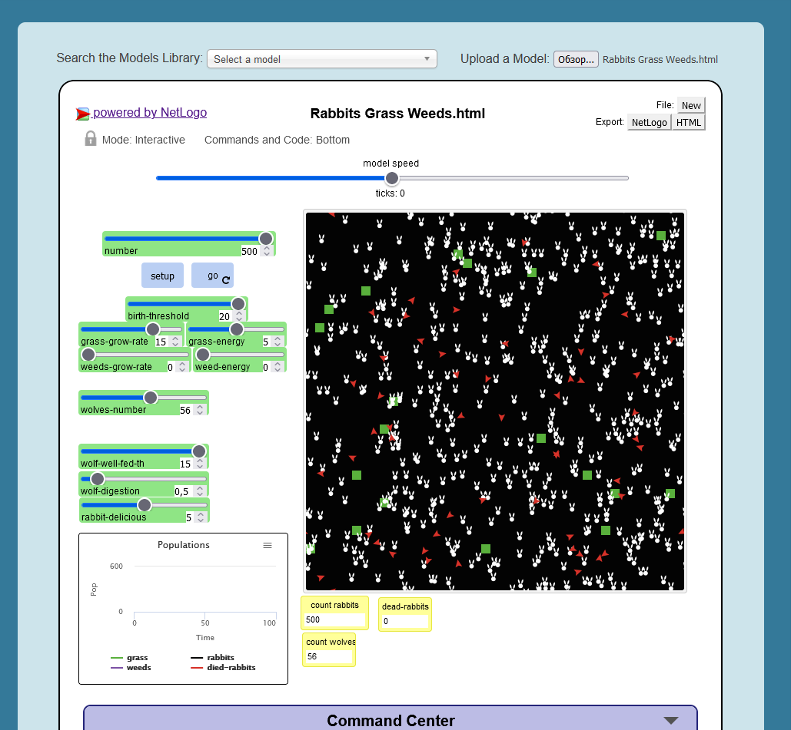

## Імітаційне моделювання комп'ютерних систем
## СПм-21-2, **Вишнівський Данііл Валерійович**
### Лабораторная работа №**2**. Редактирование имитационных моделей в среде NetLogo

 

### Выбранная модель в среде NetLogo:
[Rabbits Grass Weeds](http://www.netlogoweb.org/launch#http://www.netlogoweb.org/assets/modelslib/Sample%20Models/Biology/Rabbits%20Grass%20Weeds.nlogo)

 

### Вербальное описание модели:
Этот проект исследует простую экосистему, состоящую из кроликов, травы и сорняков. Кролики бродят хаотично, а трава и сорняки растут хаотично. Когда кролик натыкается на траву или сорняки, он ест траву и получает энергию. Если кролик набирает достаточно энергии, он размножается. Если он не получает достаточно энергии, он умирает.

Траву и сорняки можно настроить так, чтобы они росли с разной скоростью и давали кроликам разное количество энергии. Модель можно использовать для изучения конкурентных преимуществ этих переменных.

### Управляющие параметры:
- **number** определеяет количество кроликов
- **birth-threshold** определеяет количество энергии, необходимое для размножения кролика
- **grass-grow-rate** определеяет количество клеток с травой, которые появляются на каждом тике
- **grass-energy** определеяет количество энергии, которую получает кролик при поедание клетки с травой
- **weeds-grow-rate** определеяет количество клеток с сорняками, которые появляются на каждом тике
- **weeds-energy** определеяет количество энергии, которую получает кролик при поедание клетки с сорняками
- **wolves-number** определеяет стартовое количество волков
- **wolf-well-fed-th** определеяет порог насыщения волка, при котором он перестает двигаться
- **wold-digestion** определеяет количество энергии, которое расходуется каждый ход
- **rabbit-delicious** определеяет количество энергии, которое приносят кролик

### Внутренние параметры:
- **energy**. Количество энергии кролика 
- **feed-level**. Количество энергии волка

### Критерии эффективности системы:
- максимальная длительность существования популяции кроликов
- максимальная длительность существования популяции волков
- количество съеденных кроликов

### Недостатки модели:
 Хаотичное движение волков, хотя логичнее задать логику передвижение в сторону кроликов

 

### Внесённые изменения в исходную логику модели:
Были добавлены агенты типа волк. Описана логика их появления. Так же задана переменная, которая отвечает за уровень голода
<pre>
breed [wolves wolf]
wolves-own [ feed-level ]
</pre>

Добавлена переменная score - сохраняет количество съеденных кроликов
<pre>
globals [score]
</pre>

Описана логика появления волков.
<pre>
  create-wolves wolves-number [
    set color red
    setxy random-xcor random-ycor
    set feed-level random 5 
  ]
</pre>

Определена логика поведения волков
<pre>
  ask wolves [
    wolf-move
    eat-rabbit
    wolf-death
  ]
</pre>

Изменена логика перемещения кроликов: добавлена проверка на наличие волков в по направлению движения с радиусом 100
и разворота при обнаружении
<pre>
to move  ;; rabbit procedure
  rt random 50
  lt random 50
  if (count wolves-on patch-ahead 1 > 0) or (count wolves-on patch-right-and-ahead 50 1 > 0) or (count wolves-on patch-left-and-ahead 50 1 > 0) [
    rt 90 + random 90
  ]

  fd 1 
  ;; moving takes some energy
  set energy energy - 0.5
end
</pre>

Описана логика перемещения волков и поедания кроликов
<pre>
to wolf-move
  if feed-level < wolf-well-fed-th [
    rt random 50
    lt random 50
    fd 1
  ]
  ;; moving takes some energy
  set feed-level feed-level - wolf-digestion
end
</pre>

<pre>
to eat-rabbit
  let rb one-of rabbits-here                  
  if rb != nobody  [ 
    ask rb [ die ]
    set score score + 1
    set feed-level feed-level + rabbit-delicious
  ]
end
</pre>

А также логика смерти волка
<pre>
to wolf-death
  if feed-level < 0 [ die ]
end
</pre>

Ниже предствлен интерфейс модели

