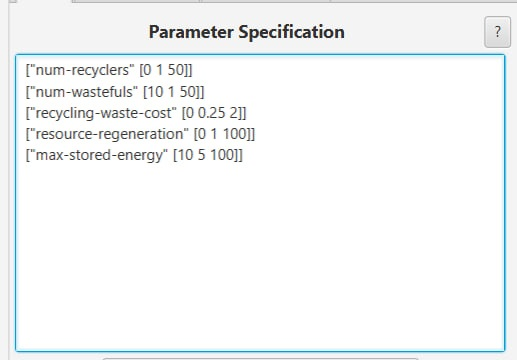
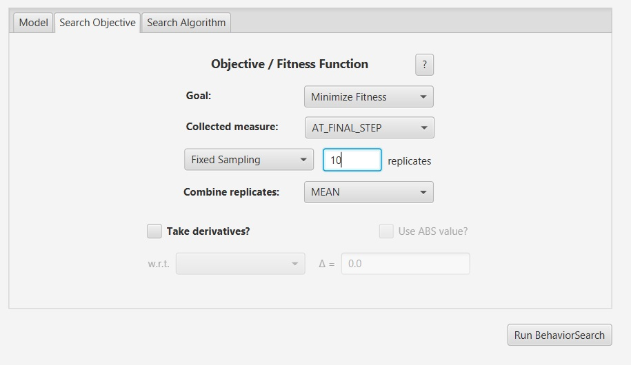
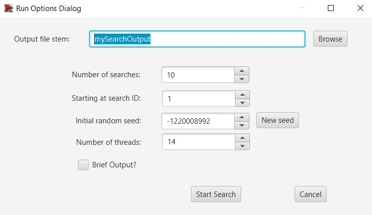
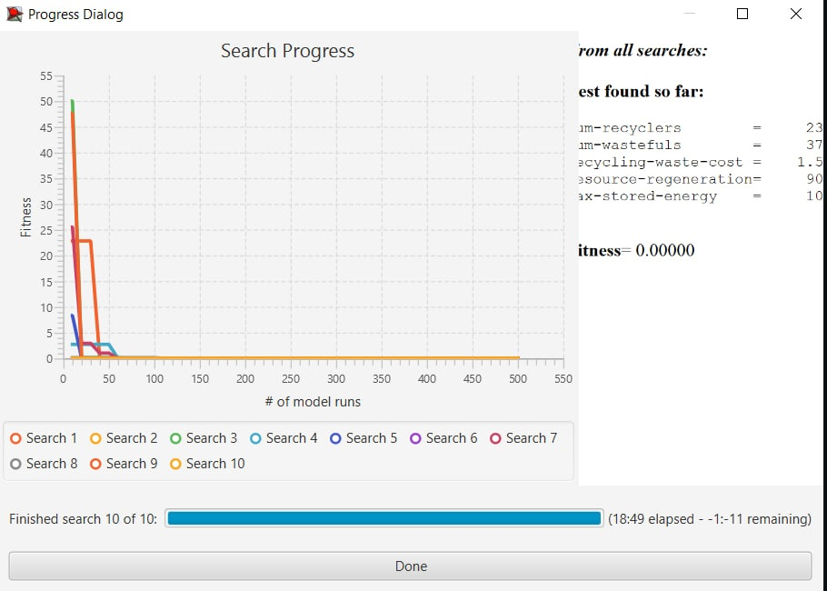
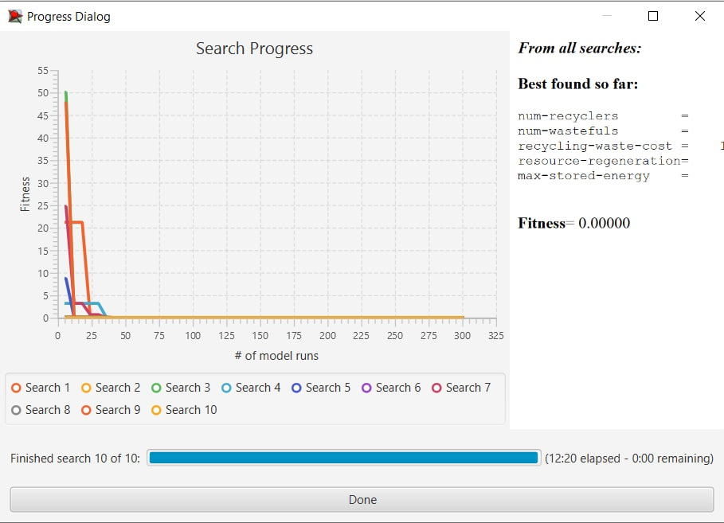

## Імітаційне моделювання комп'ютерних систем
## СПм-21-2, **Вишнівський Данііл Валерійович**
### Лабораторная работа №**2**. Редактирование имитационных моделей в среде NetLogo

 

### Выбранная модель в среде NetLogo:
[Recycling](http://www.netlogoweb.org/launch#http://www.netlogoweb.org/assets/modelslib/Curricular%20Models/Urban%20Suite/Urban%20Suite%20-%20Recycling.nlogo)
Доступно в файле с первой лабораторной работы
 

### Настройки среды BehaviorSearch:

**Параметры модели**:  
*Параметры и их предполагаемые диапазоны были автоматически извлечены средой BehaviorSearch из выбранной имитационной модели*:
<pre>
["num-recyclers" [0 1 50]]
["num-wastefuls" [10 1 50]]
["recycling-waste-cost" [0 0.25 2]]
["resource-regeneration" [0 1 100]]
["max-stored-energy" [10 5 100]]
</pre> 
Используемая **мера**:  
Для фитнес-функции - было выбрано **значение количества популяции recyclers**
и указано в параметре "**Measure**":
<pre>
count recyclers
</pre>
Количесво recyclers берется с финального такта симуляции, так как нас интересует итоговое значение. 
Параметр остановки по условию ("**Stop if**") используется при достижения значения более 1000.
Общий вид вкладки настроек параметров:

**Настройки целевой функции** (Search Objective):  
Целью подбора параметров имитационной модели, описывающей измениение популяции recyclers/wasteful, является **максимизация** значения количества recyclers по окончанию имитации - это указано через параметр "**Goal**" со значением **Maximize Fitness**. Т.е. нужно найти такие параметры настроек модели, при которых recycles выживают дольше всего или образуется устойчивая система. 
Воизбежание искажения результатов из-за случайных значений, используемых в логике самой имитационной модели
Общий вид вкладки настроек целевой функции:

**Настройки алгоритма поиска** (Search Algorithm):  
На этом этапе была определена модель, настроены её параметры (т.е. указано, какие из них неизменны, а какие в процессе поиска могут меняться и в каких диапазонах), и выбрана мера эффективности, лежащая в основе функции приспособленности, позводяющей оценить "качество" каждого из проверяемого BehaviorSearch варианта решения.  
В ходе исследования на лабораторной работе используются два алгоритма: Случайный поиск (**RandomSearch**) и Простой генетический алгоритм (**StandardGA**).   
 

### Результаты использования BehaviorSearch:
Диалоговое окно запуска поиска 

Результат поиска параметров имитационной модели, используя **генетический алгоритм**:

Результат поиска параметров имитационной модели, используя **случайный поиск**:
